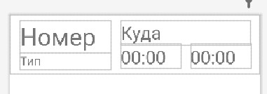
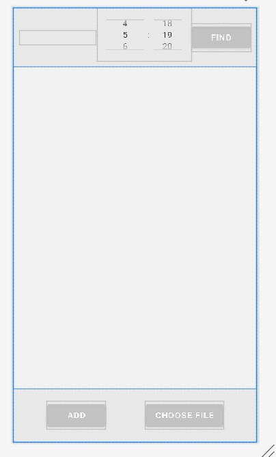
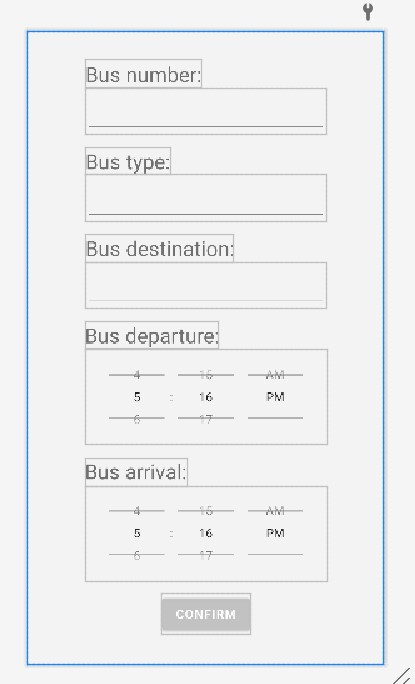

# Расписание автобусов

---
Лабораторная работа 2

Вариант 9

В справочной автовокзала хранится расписание движения автобусов. Для каждого рейса указаны его номер, тип автобуса, пункт назначения, время отправления и прибытия. Вывести информацию о рейсах, которыми можно воспользоваться для прибытия в пункт назначения раньше заданного времени.

Были выполнены все пункты:
1.	Предусмотреть возможность ввода/вывода элементов в отдельном активити/фрейме.
2.	Добавить возможность редактирования списка, удаления отдельных позиций.
3.	Меню доступных функций должно показываться по долгому нажатию на элемент списка.
4.	Создать собственный адаптер для списка.
5.	На 9-10 реализовать функцию открытия файла и заполнения из него полей списка. Использовать стандартный компонент для отображения дерева папок.

---

При запуске приложения на экране появляется интерфейс из [activity_main.xml](./res/layout/activity_main.xml). За него отвечает класс [MainActivity](./java/com/example/busschedule/MainActivity.kt).
Основную часть экрана здесь занимает компонент _ListView_, который содержаит основную информацию. 
Для хранения информации об автобусах были созданы модель списка [BusList](./java/com/example/busschedule/BusList.kt) и сама модель [Bus](./java/com/example/busschedule/Bus.kt).
Для отображения информации из моделей был создан пользовательский адаптер [BusAdapter](./java/com/example/busschedule/BusAdapter.kt) (п.4) и его [xml](./res/layout/bus.xml). 
Всю информацию для списка приложение приложение может либо сгенерировать (используется для примера), либо брать из файла, на который укажет пользователь (п.5)
По долгому нажатию на элемент списка появляется контекстное меню[(xml)](./res/menu/context_menu.xml), которое предлагает редактировать либо удалить элемент (п.2-3).
Редактирование и добавление новых позиций (автобусов) происходит в новом [EditActivity](./java/com/example/busschedule/EditActivity.kt) (его [xml](./res/layout/activity_edit.xml)) (п.1).
После возвращения данные не теряются, можно добавить несколько подряд и всё сохранится. Кстати, по созданию и после добавления или редактирования данные сортируются по дате отправления.

На главном экране по заданию необходимо вывести список автобусов с определенным пунктом назначения и чтобы время их прибытия было меншьше заданного.
Время выбирается _TimePicker_-ом, пункт назначения - _выпадающим списком_. Элементы выпадающего списка - это все уникальные пункты назначения по всем автобусам.

Приложение также локализировано для английского и русского языка.

__Весь функционал можно посмотреть в [видео](./Video.mp4)__

---
__Приложение__ Ниже будут скриншоты xml:

---

---

---

